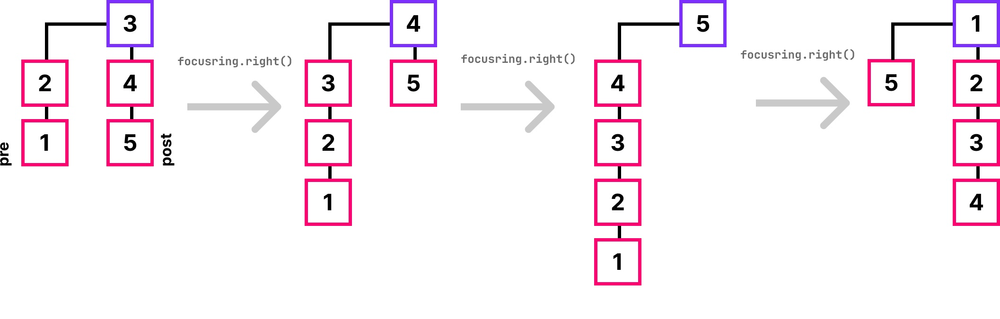

# Focus Ring


This section explains the concept of the data structure Focus Ring, how it works internally and how it can be used by developers.


## Introduction

### What is a Focus Ring?

A Focus Ring is a data structure in which the elements are arranged as a ring in the outward view. At each point in time, one element of the ring can be accessed with O(1) - this element is called the focus. This focus can be shifted to the left or also to the right. Since the elements are arranged in a ring, the user of the Focus Ring will therefore never reach an end by moving the focus. If the last element of the ring is reached and the focus is shifted to the right again, the first element comes into focus.

### What can a Focus Ring be used for?

There are many different use cases for a Focus Ring. The following are common ones:

#### Image gallery

A good application for the Focus Ring could be an image gallery. The user is currently looking at one image, which is the focus. With arrow buttons on the left and right, the focus can be moved to the next or previous image.

#### Rollers

On mobile devices often a roller is used to select date, time or a month. This is a perfect use case for the Focus Ring as well, since there is always one "chosen" element. Scrolling through the other elements can be realized by moving the focus.

Similar to the date roller on mobile devices, another implementation that uses a Focus Ring is a slot machine. The slot machine has been created during this IP5 to show how Focus Rings could be used in applications. This slot machine uses three focus rings - one for each roller, as shown below:

<figure><figcaption><p>A slot machine where each roller is implemented using a Focus Ring.</p></figcaption></figure>

The working slot machine can be tried out here: [Slot machine demo application](https://wildwyss.github.io/ip5-overview/contrib/p5\_wild\_wyss/src/focusring/example/SlotMachine.html).

Based on the concept of the [Kolibri Iterator](iterator.md), a Focus Ring can be implemented with little effort.

## Features

* **Immutability:** The Focus Ring is created as an immutable data structure. Meaning, a change of the data structure returns a new object.
* **Direct access:** The focus of the ring can be accessed with O(1).
* **Never ending iteration:** The implementation of the Focus Ring is made in such a way that an end of the elements cannot be reached. Instead, the iteration starts again with the first element.

## Implementation

The Focus Ring is internally implemented with two [Kolibri Iterators](iterator.md), which are subsequently called `pre` and `post`. The following figures illustrate the internal handling of the iterators when the focus is shifted several times in one direction. The element that is in focus is always the head element of `post` and is drawn in purple.

The following figure demonstrates what happens when the focus is shifted to the right, but no more element is on the right side focus:

<figure><figcaption><p>What happens when the focus is moved right and post has only one element?</p></figcaption></figure>

`pre` is reversed and replaces `post`. The element focused before will become the only element in `pre`. In focus is now the element, that was previously the last of `pre`. IThis is how a ring is formed.

The following figure demonstrates what happens when the focus tried to shift to the left, but `pre` is empty:

<figure><figcaption><p>What happens when the focus is moved left and pre is empty?</p></figcaption></figure>

All elements of `post` are reversed and add added to `pre`. `post` than gets cleared. Now the first element of `pre` is removed and added to `post`. This way the next element comes into focus.


It is important to note that the `post` side must never be empty. Otherwise no element would be in focus.


## Usage

To initialize the Focus Ring a **non-emtpy iterator** is required.


Since the Focus Ring is immutable, it must be reassigned for further processing.


```javascript
// creates a Focus Ring with the elements from the ArrayIterator
const elems           = ArrayIterator([1,2,3]);
const focusRing       = FocusRing(elems);
  
// the element which is currently in the focus
const focusElement    = focusRing.focus();

// the element to the right or left of the focus
const rightElement    = focusRing.right().focus();
const leftElement     = focusRing.left() .focus();
  
// since the focusring is immutable, it must be reassigned
onst shiftedFocusRing = focusRing.right();
```

## References

| Simon Peyton Jones, A Taste of Haskell - part1 July 23, OSCON 2007: | [https://www.youtube.com/watch?v=jLj1QV11o9g\&t=224s](https://www.youtube.com/watch?v=jLj1QV11o9g\&t=224s) |
| ------------------------------------------------------------------- | ---------------------------------------------------------------------------------------------------------- |

