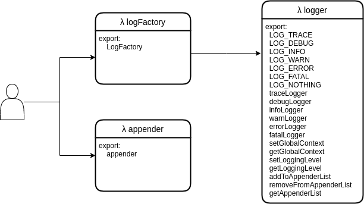

# Logging framework


This section describes the logging framework. The features, implementation and usage are considered in-depth. For a quick start on how to use it the part [Usage](logging-framework.md#usage) can be viewed.


## Introduction

### What is a logging framework?

Developers use logging to record the flow or activities of a program. For this purpose, statements are implemented at specific points in the program code that record the current state or events.

Requirements for good logging are very high, which is why it quickly becomes complicated to integrate meaningful logging into an application. Logging frameworks therefore offer ready-made solutions that developers can easily integrate into their applications. A well-known logging framework for Java is for example [Log4j](https://logging.apache.org/log4j/2.x/).

### Why does the Kolibri need a logging framework?

Developers who are used to the Java programming language often miss the possibility of meaningful logging in JavaScript. Therefore, a new logging framework that offers similar features as Log4j is to be built into the Kolibri.

## Research

Before starting with the implementation of the logging framework for Kolibri, existing logging frameworks were searched to reuse possible good ideas. Libraries that were implemented purely functional are also considered. In the end, two libraries emerged as models.

### Log4j

The already mentioned framework Log4j is probably the most used for the programming language Java. From Log4j various concept ideas are taken over. The most important concepts are listed below:

* Priorities: Every log statement has a specific priority (also called log level).
* Active level: The activated level is used to decide which priorities should be logged.
* Layout: A log message can be layout/formatted as desired.
* Appender: Log messages can be sent to different so-called "appenders", which define a special behaviour what to do with the log messages. For example, an `ArrayAppender` could write each log message into an array.

### Monad-logger

[Monad-logger](https://github.com/snoyberg/monad-logger) is a logging library for Haskell, a widely known functional programming language. From the monad-logger rather concepts of the implementation are inspired than concrete functionalities. From the monad-logger the idea to have a global log function, which is made available preconfigured on all log levels is taken. Also the idea that a log level should be a small data structure with information about the level is taken from monad-logger.

## Features

The following feature set is implemented in the logging library:

* **Different logger levels**: Each logger logs it's messages on a specific logger level (analog to Log4j). A global logging level determines which log messages should be output at the moment.
* **Raising log levels**: Messages logged using a logger on a higher level are also output if a lower logging level is active. However, not in the reverse case.
* **Context**: Each logger logs its messages on a context. This can be used to identify where the log statement comes from.
* **Restrict contexts**: The logging framework supports that contexts can be restricted. This way, logging messages that are not needed can be ignored.
* **Formatting of log messages**: The format of the logged message can be defined by the user.
* **Appender**: There are several predefined appenders that can be used to configure the logging framework. For example, log messages can be added to the `ConsoleAppender` and the `ArrayAppender`. If an appender stores the messages in an internal data structure, they can be retrieved again. Following appenders are implemented:
  * `ConsoleAppender`: Writes log messages to the web console.
  * `ArrayAppender`: Wirtes log messages into an array.
  * `CountAppender`: Keeps statistics about the log messages already made.
  * `ObservableAppender`: Notifies its listeners when a new log message has arrived.

## Module overview

Modules have been created to divide up the various responsibilities. The following diagram illustrates the dependencies of the modules:

<figure><figcaption><p>Dependency diagram logger modules</p></figcaption></figure>

| Module          | Description                                                                                                                                                      |
| --------------- | ---------------------------------------------------------------------------------------------------------------------------------------------------------------- |
| `logFactory.js` | Exports a convenience function that simplifies the configuration of the logger. This way loggers on each level can be created simply.                            |
| `logger.js`     | Exports all existing `LogLevel`s and preconfigured logging functions for each `LogLevel`. Some configuration functions for the environment are exported as well. |
| `appender.js`   | Defines different appenders that are used to process log messages.                                                                                               |


`appender.js` is representative for all appenders. In fact, each appender forms its own module.


## Concepts of the implementation

This section describes the logging framework conceptually.

Roughly speaking, the logging framework has two aspects that need to be distinguished:

1. Environment of the logging framework
2. Loggers

The logging environment defines the "what". The environment defines what is logged, where it is logged and if logging is done at all. Changes made to the environment will affect all loggers.

A logger, on the other hand, defines the "how". A logger defines how a logging message looks like and on which level it is logged. When a new logger is created and configured, this does not affect existing loggers.


**logging level vs. logger level**\
The term "logging level" refers to the lowest level that a log message must have in order to be logged. It is configured on the environment.\
"Logger level", on the other hand, refers to the priority with which the respective logger writes log messages.


### Configuration of the logging environment

#### Context

The environment provides one global context. This globally active context is implemented in the module `logger.js` and represents a variable string. A log message is logged only if the environment's context is a prefix of the log message context.

By means of the following function the environments context is adjusted at runtime. So it is possible to only show log messages which have a specific context.

```javascript
const myLogContext = "GLOBAL.CONTEXT"
setGlobalContext(myLogContext);
// Only messages from loggers whose context starts with "GLOBAL.CONTEXT" are logged.
```

#### Logging level

The individual log levels are arranged in a priority list. The currently active logging level is implemented as a global state.&#x20;

Log messages that refer to a lower log level are ignored, messages that refer to the same level or a higher one are processed.

The logging level can be changed using the provided function `setLoggingLevel()`.

Using the function `getLoggingLevel()` the current logging level is returned.

```javascript
import { LOG_DEBUG } from "./logger.js";

setLoggingLevel(LOG_DEBUG);
const loggingLevel = getLoggingLevel();
```

#### Appender

To process log messages, at least one appender must be defined. An appender is an object that defines per log level how a message is logged. These appenders are managed analog to the logging level.

Appenders can be configured as followed:

```javascript
import { addToAppenderList } from "./logger/logger.js";
import { Appender }          from "./logger/appender/consoleAppender.js";

const consoleAppender = Appender();
addToAppenderList(consoleAppender);
// Every log message will be logged to the console from now on
```

There are some predefined appenders. Custom appenders can be implemented as well. [Usage of appenders](logging-framework.md#appender-1) can be considered to see which appender exist and how new appenders can be developed.

### Configuration of loggers

There is only one logging environment, but there are any number of loggers. These loggers can all be configured and customized individually.

#### Basic concept

The core of the logger is the following function:

```javascript
const logger = loggerLevel => context => formatMsg => msg =>
  LazyIf(
      // determines if log messages should be logged or not
      messageShouldBeLogged(loggerLevel)(context)
  )
  (Then(() =>
        // append message to all appenders
        appenderList
            .map(appender => {
              const levelName = loggerLevel(snd);
              const levelCallback = appender[levelName.toLowerCase()];
              return levelCallback(formatMsg(context)(levelName)(evaluateMessage(msg)))
            })
            // return True if log message has been appended to every appender
            .reduce((acc, cur) => and(acc)(cur), True)) // every() for array of churchBooleans
  )
  (Else(() => False));
```

The parameters passed to the logger function are used to configure the logger and are explained in detail in this section.


To avoid wrong configured loggers, the function `logger` is not exported. Logger functions preconfigured with log levels are exported instead. This is also why this function has been implemented curried: it allows to preconfigure the logger and reuse it at will.


#### Logger level

Each logger logs at exactly one log level. The log level of a logger cannot be changed.

```javascript
import { debugLogger } from "./logger/logger.js"

// Will log on level debug
let debug = debugLogger;
```

#### Logger context

A logger is configured with an immutable context. This context is defined when a logger is created and stored as a string. It will be compared with the context set on the environment during a log operation.

```javascript
// use the previously defined debug logger and set it's context
let debug = debug("ch.wyss.tobias");
```

#### Format message

Before log messages are logged, a formatting function is applied to them. This formatting function is of type `MsgFormatType` and is passed directly to the logger. The function takes the following parameters in curried style:

| Parameter    | Type     | Description                                  |
| ------------ | -------- | -------------------------------------------- |
| `context`    | `String` | The context of this log message.             |
| `logLevel`   | `String` | The string representation of this log level. |
| `logMessage` | `String` | The message that should be logged.           |

From these parameters, an arbitrarily formatted string can now be compiled, which is then finally logged.

For example, the format function can be implemented like this:

```javascript
/**
 * Creates a custom log message using the given parameters.
 * @type { FormatLogMessage }
 */
const formatLogMsg = context => logLevel => logMessage => {
  // add a date to the logmessage. In this way you can add information you want to the logmessage.
  const date = new Date().toISOString();
  return `${context}: [${logLevel}] ${date}: ${logMessage}`;
};

// use the previously defined logger and pass the formatting function to it.
let debug = debug(formatLogMsg);
```

#### Log a message

The preconfigured logger is now ready to log messages on the defined log level using the given context and the message formatting function:

```javascript
debug("Andri Wild");
debug("Tobias Wyss");
debug("Prof. Dierk Koenig");
```

## Usage

The logging framework is fully modularised and can thus be integrated into an existing or new application.

### Create loggers using the `LogFactory`

The simplest way to use the logging framework is to create loggers using the `LogFactory`. The `LogFactory` is a convenience function that can be parameterised and returns fully configured loggers at each log level.

This factory can be used to configure the logging framework as desired.

#### Parameter der `LogFactory`

| Parameter name | Type               | Description                                                                              |
| -------------- | ------------------ | ---------------------------------------------------------------------------------------- |
| `context`      | `String`           | The context of the logger. See [Context](logging-framework.md#context) for more details. |
| `formatMsg`    | `FormatLogMessage` | A function that formats log messages before they are appended.                           |


All loggers returned by the log factory will have the same context and the same formatter. They differ only in their log levels.


#### Example use of the `LogFactory`

Assumption that the LoggingFramework is located under `/logger/`.

```javascript
import { 
    LOG_DEBUG, 
    LOG_ERROR, 
    setGlobalContext, 
    setLoggingLevel 
}                     from "./logger/logger.js";
/* Use a different appender by just importing the appender from another file. */
import { Appender }   from "./logger/appender/consoleAppender.js";
import { LogFactory } from "./logger/logFactory.js";

// Configure the environment
// define a log target
addToAppenderList(Appender())

// Messages from level debug and above should be logged in this application.
// The value can be changed during runtime, which affects the logged messages.
setLoggingLevel(LOG_DBEUG);

// only logmessages whose context is prefixed with "ch.fhnw" will be logged
setGlobalContext("ch.fhnw");

// use the LogFactory to create new loggers

// all log messages have following context in this exmaple
const logContext   = "ch.fhnw.sample";

// each logmessage should be formatted using this function, before logging.
const formatLogMsg = context => logLevel => logMessage =>
    `${context}: [${logLevel}]: ${logMessage}`;

// get debug & error log function using our configuration
// functions for not used in this example.
const { debug, error } = 
    LogFactory(logContext)(formatLogMsg);

// log level
debug("This is a message with loglevel debug.");
error("This is a message with loglevel error.");
```

### Appender

#### Default appenders

The logging framework offers some predefined appenders which are described below:

| Appendername         | Beschreibung                                                     |
| -------------------- | ---------------------------------------------------------------- |
| `ConsoleAppender`    | Writes log messages to the JavaScript console using `console.*`. |
| `ArrayAppender`      | Appends log messages on an array                                 |
| `CountAppender`      | Keeps statistics about the log messages already made.            |
| `ObservableAppender` | Notifies its listeners when a new log message has arrived.       |

#### Custom appenders

By adhering to the defined `AppenderType` interface, custom appenders can be implemented. An example implementation of a `ConsoleAppender` is given here:

```javascript
// This appender prints log messags to the console.
/**
* Provides a console Appender.
* @constructor
* @returns {AppenderType<void>}
*/
const Appender = () => ({
  trace:     consoleAppend,
  debug:     consoleAppend,
  info:      consoleAppend,
  warn:      consoleAppend,
  error:     consoleAppend,
  fatal:     consoleAppend,
  getValue:  () => {}; // this appender returns no values
});

/**
* @param {String} msg - the message that should be logged to the console.
*/
const consoleAppend = (msg) => {
  console.log(msg);
  return True; // return a churchBoolean if Logging was successful
}
```


If an appender stores log messages in a data structure, attention must be payed that not more log messages are stored than the data structure is able to contain. So suitable cleanup mechanism must be provided, if this size is exceeded. Please refer to the implementation of the `ArrayAppender` for an example.


#### Use appenders

To apply appenders the provided functions exported by the module `logger.js` need to be used. Following functions are provided by `logger.js` for managing the current loggers:

| Name                     | Parameters               | Description                                                                                      |
| ------------------------ | ------------------------ | ------------------------------------------------------------------------------------------------ |
| `addToAppenderlist()`    | `appender: AppenderType` | Adds a new appender to the logging environment                                                   |
| `getAppenderList()`      | -                        | Returns a copy of the array containing all appenders.                                            |
| `removeFromAppenderList` | `item: AppenderType`     | Removes the `item` from the current appenders. A copy of the array of the appenders is returned. |

The good thing about globally used appenders is, that it does not matter which appender is used during development. Which appenders should be used can be decided during the testing of the application or even changed at runtime.

The second handy thing about appenders generally is, that they offer the ability to extend the logging framework with custom appenders as described above in the section [custom appenders](logging-framework.md#custom-appenders).

### Log messages

If the logger has been completely configured, any text message can be logged:

```javascript
// retrieve log functions from a configured LogFactory
const { debug, error } = ...;

debug("Tobias Wyss");

```

#### Lazy logging

If a log message depends on more complex calculations, it can also be evaluated lazy. Using this functionality the log message is only evaluated if it is really logged.

```javascript
import { lazy } from "logger/lambdaCalculus.js"
// retrieve log functions from a configured LogFactory
const { debug, error } = ...;

// solve a hard puzzle
const difficultCalculation = () => ...;

debug(lazy(difficultCalculation()));
```

### LogUi

<figure><figcaption></figcaption></figure>

The LogUI is a visual representation of all log messages appended to the `ObservableAppender`. It can be used to search the log messages or filter them by log level.

The UI offers following functions:

* Use the **Global Context** field to change the [Global Context](logging-framework.md#global-context) of the environment.
* Use the **Logging Level** to select the [logging Level](logging-framework.md#log-levels).
* Use the **Filter** field to display only log messages that contain the entered text
* Select a **chip** to show or hide messages belonging to this [log level](logging-framework.md#log-levels).
* Use the **RESET** button to clear the log messages container.

#### Usage

You can use the LogUi in your application by:

Assumption that the logging framework is located under `/logger/`.

```javascript
import { LogFactory }                     from "./logger/logFactory.js";
import { LOG_TRACE,addToAppenderList }    from "./logger/logger.js";

import { Appender as ObservableAppender } from "./logger/observableAppender.js";
import { Appender as ConsoleAppender }    from "./logger/consoleAppender.js";


// use the observable Appender here (see imports)
addToAppenderList(ObservableAppender());
addToAppenderList(ConsoleAppender());

const formatLogMsg = ... ;

const logger1 = LogFactory("ch.fhnw")(formatLogMsg);

// Refer to a div in your HTML
const container = document.getElementById("container");

// add the LogUi to your document using this imported function.
createLogUi(container);
```

For ideas how to use the log ui in an application, please consider the example. The source code can be found [here](https://github.com/wildwyss/Kolibri/tree/main/contrib/p5\_wild\_wyss/src/logger/logUi).

The running example can be found [here](https://wildwyss.github.io/ip5-overview/contrib/p5\_wild\_wyss/src/logger/logUi/example/logUiExampleView.html). Note that you have to unwrap it by clicking on the Kolibri logo on the right side.

## Future features

This section describes further features that could extend the logging framework.

| Feature                          | Description                                                                                                                                                                                                                           |
| -------------------------------- | ------------------------------------------------------------------------------------------------------------------------------------------------------------------------------------------------------------------------------------- |
| LogUi modes                      | When new log messages come into the log ui, the container is scrolled to the bottom. There should be an **inspection mode** which disables incoming of new log messages therefore. This mode should be enabled and disabled manually. |
| Performance measurement appender | An appender which automatically measures the time between two log messages would be helpful. This could be used for performance measurements.                                                                                         |
| log different message types      | At the moment only `String`s or functions which produce a `String` can be logged. It would be helpful to log other things like `Object`s or `Number`s.                                                                                |

## Glossary

| Term      | Description                                                                                                                                 |
| --------- | ------------------------------------------------------------------------------------------------------------------------------------------- |
| Appender  | Appenders are used to log messages to different targets. Refer the section [Features](logging-framework.md#features) for more informations. |
| Factory   | A class or method which creates objects.                                                                                                    |
| immutable | A data structure or variable which can no be changed.                                                                                       |
| lazy      | An expression is called lazy, if it's evaluated at the time it is used.                                                                     |
| Priority  | Describes the level of a log message.                                                                                                       |
| pure      | Functions which do not have a side effect are called pure.                                                                                  |

## References

| Apache Log4J | [https://logging.apache.org/log4j/2.x/](https://logging.apache.org/log4j/2.x/)       |
| ------------ | ------------------------------------------------------------------------------------ |
| Monad Logger | [https://github.com/snoyberg/monad-logger](https://github.com/snoyberg/monad-logger) |
