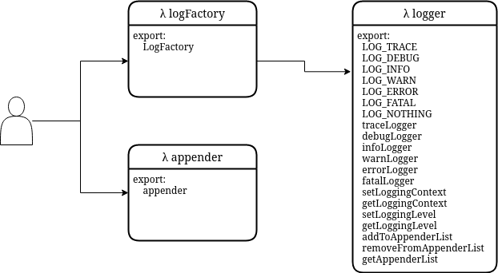

# Logging framework


This section describes the logging framework. The features, implementation and usage are considered in depth. For a quick start on how to use it head directly to the part [Usage](logging-framework.md#usage).


## Introduction

### What is a logging framework?

Developers use logging to record the flow or activities of a program. For this purpose, statements are implemented at specific points in the program code that record the current state or events.

Requirements for good logging are very high, which is why it quickly becomes complicated to integrate meaningful logging into an application. Logging frameworks therefore offer ready-made solutions that developers can easily integrate into their applications. A well-known logging framework for Java is for example [Log4j](https://logging.apache.org/log4j/2.x/).

### Why does the Kolibri need a logging framework?

Developers who are used to the Java programming language often miss the possibility of meaningful logging in JavaScript. Therefore, a new logging framework that offers similar features as Log4j is to be built into the Kolibri.

## Research

Before starting with the implementation of the logging framework for Kolibri, existing logging frameworks were searched to reuse possible good ideas. Libraries that were implemented purely functionally were also considered. In the end, two libraries emerged as models.

### Log4j

The already mentioned framework Log4j is probably the most used for the programming language Java. From Log4j various concept ideas were taken over. The most important concepts are listed below:

* Priorities: Every log statement has specific priorities.
* Active level: The activated level is used to decide which priorities should be logged.
* Layout: A log message can be layout/formatted as desired.
* Appender: Log messages can be sent to different so-called "appenders", which define a special behaviour what to do with the log messages. For example, a `FileAppender` could write each log message to a file.

### monad-logger

[Monad-logger](https://github.com/snoyberg/monad-logger) is a logging library for Haskell, a widely known functional programming language. From the monad-logger rather concepts of the implementation were inspired than concrete functionalities. From the monad-logger the idea to have a global log function, which is made available preconfigured on all log levels was taken. Also the idea that a log level should be a small data structure with information about the level was taken from monad-logger.

## Features

The following feature set has been defined for the logging library:

* **Different log priorities**: Each log message should have a log priority (analog to Log4j) including a global log level that determines which log messages should be output at the moment.
* **Raising log levels**: Messages with higher log levels are also output if a lower log level is active. However, not in the reverse case.
* **Context**: Each log message has a context. This can be used to identify where the log statement comes from.
* **Disable contexts**: The logging framework supports that contexts can be restricted to only see log messages from a specific origin.
* **Formatting of log messages**: The format of the logged message can be defined by the user.
* **Appender**: There are several predefined appenders that can be used to configure the logging framework. For example, you can log using the ConsoleAppender and the ArrayAppender. In this way one can easily define where the log messages should go to. Following appenders have been implemented:
  * `ConsoleAppender`: Writes log messages to the JavaScript-console
  * `ArrayAppender`: Wirtes log messages into and array.
  * `CountAppender`: Keeps statistics about the log messages already made.
  * `ObservableAppender`: Notifies its listeners when a new log message has arrived.

## Implementation

The implementation of the logger functionality is finely documented in the source code files. This section forms an abstracted overall view.

### Basic concept

The core of the logger framework is the following logger function:

```javascript
const logger = loggerLevel => context => formatMsg => msg =>
LazyIf(
      messageShouldBeLogged(loggerLevel)(context)
    )
    (Then(() =>
      appenderList
        .map(append =>
             appender[loggerLevel(snd).toLowerCase()](formatMsg(context)(loggerLevel(snd))(evaluateMessage(msg))))
        .reduce(  (acc, cur)  => and(acc)(cur), True))
    )
    (Else(() => False));
```

This function can be called step by step in curried style, allowing the logger to be configured.

#### Modules

Modules have been created to divide up the various responsibilities. The following diagram illustrates the dependencies of the modules:

<figure><figcaption><p>Dependency diagram logger modules</p></figcaption></figure>

| Module          | Description                                                                                                               |
| --------------- | ------------------------------------------------------------------------------------------------------------------------- |
| `logger.js`     | Exports all existing `LogLevel`s and preconfigured logging functions for each `LogLevel`.                                 |
| `appender.js`   | Defines different appenders that are used to process LogMessages.                                                         |
| `logFactory.js` | Exports a convinience function that simplifies the configuration of the logger and applies an appender to all log levels. |

### Context

#### Global context

If one or more loggers are created in a program, they are all subject to a global context. This context is implemented in the module `logger.js` and represents a variable string. Only LogMessages whose context in the prefix matches the global one are logged.

By means of the following function the global context is adjusted at runtime. So it is possible to only show log messages which have a specific context.

```javascript
setGlobalContext(INITIAL_GLOBAL_CONTEXT);
```

#### Logger context

A logger is configured with an immutable context. This context is stored as a string and compared with the global context during a log operation.

```javascript
const consoleLogger = LogFactory("LOGGER_CONTEXT")(formatLogMsg);
```

### Log levels

The individual log levels are arranged in a priority list. The currently active logging level is implemented as a global state.&#x20;

Log messages that refer to a lower log level are ignored, messages that refer to a log level of the same size or higher are processed.

#### Change logging level

Using the provided function `setLoggingLevel(new_logging_level)` one can change the currently active logging level. This will affect all loggers.

Using the function `getLoggingLevel()` the current logging level is returned.

## Usage

The logging framework is fully modularised and can thus be integrated into an existing or new application.

### Usage via `LogFactory`

The simplest way to use the logging framework is to use the `LogFactory`. The `LogFactory` is a convenience function that can be parameterised and returns fully configured loggers at each LogLevel.

This factory can now be used to configure the logging framework as desired.

#### Parameter der `LogFactory`

| Parameter name | Type               | Description                                                                                                                            |
| -------------- | ------------------ | -------------------------------------------------------------------------------------------------------------------------------------- |
| `context`      | `String`           | The context of the logger. The globally set context must be a prefix of the context of the logger so that the log messages are logged. |
| `formatMsg`    | `FormatLogMessage` | A function that formats log messages before they are appended.                                                                         |

#### Example use of the `LogFactory`

Assumption that the LoggingFramwork is located in the root under `/logger/`.

```javascript
import {LOG_DEBUG, LOG_ERROR, setGlobalContext, setLoggingLevel} from "logger/logger.js";
/* Use a different appender by just importing the appender from another file. */
import {Appender} from "logger/appender/consoleAppender.js";
import {LogFactory} from "logger/logFactory.js";

// define a log target
addToAppenderList(Appender())

// Messages from level debug and above should be logged in this application.
// The value can be changed during runtime, which affects the logged messages.
setLoggingLevel(LOG_DBEUG);

// only logmessages whose context is prefixed with "ch.fhnw" will be logged
setGlobalContext("ch.fhnw");

// all log messages have following context in this exmaple
const logContext   = "ch.fhnw.sample";

// each logmessage should be formatted using this function, before logging.
const formatLogMsg = context => logLevel => logMessage =>
    `${context}: [${logLevel}]: ${logMessage}`;

// get debug & error log function using our configuration with a 
// prebuilt appender which writes log messages to the console.
// functions for other loglevels are ignored.
const { debug, error } = 
    LogFactory(logContext)(formatLogMsg);

// log level
debug("This is a message with loglevel debug.");
error("This is a message with loglevel error.");
```

### Appender

The logging framework uses appenders to handle the log messages in different ways.&#x20;


#### Default appenders

The logging framework offers some preconfigured appenders which are described below:

| Appendername         | Beschreibung                                                     |
| -------------------- | ---------------------------------------------------------------- |
| `ConsoleAppender`    | Writes log messages to the JavaScript-console using `console.*`. |
| `ArrayAppender`      | Appends log messages on an array                                 |
| `CountAppender`      | Keeps statistics about the log messages already made.            |
| `ObservableAppender` | Notifies its listeners when a new log message has arrived.       |

#### Custom appenders

By adhering to the defined `AppenderType` interface, custom appenders can be implemented. An example implementation of a `ConsoleAppender` is given here:

```javascript
// This appender prints log messags to the console.
/**
* Provides a console Appender.
* @constructor
* @returns {AppenderType<void>}
*/
const Appender = () => ({
  trace:     consoleAppend,
  debug:     consoleAppend,
  info:      consoleAppend,
  warn:      consoleAppend,
  error:     consoleAppend,
  fatal:     consoleAppend,
  getValue:  () => {}; // this appende returns no values
});

/**
* @param {String} msg - the message that should be logged to the console.
*/
const consoleAppend = (msg) => {
  console.log(msg);
  return True; // return a churchBoolean if Logging was successful
}
```


If your appender stores log message in a datastructure, make sure to track the max size of it and provide suitable cleanup mechanisms, if this size is exceeded. Please refer to the implementation of the `ArrayAppender` for an example.


#### Use appenders

To use appenders you have to use the provided functions by the module `logger.js`.

Following functions are provided by `logger.js` for managing the current loggers:

| Name                     | Parameters               | Description                                                                                     |
| ------------------------ | ------------------------ | ----------------------------------------------------------------------------------------------- |
| `addToAppenderlist()`    | `appender: AppenderType` | Adds a new appender to the loggingframework                                                     |
| `getAppenderList()`      | -                        | Returns a copy of the array containing all appenders.                                           |
| `removeFromAppenderList` | `item: AppenderType[]`   | Removes the `item` from the current appenders. A copy of the array of the appender is returned. |

The cool thing about globally used appenders is, that you do not have to worry about which appender to use when developing. You can choose which appenders you want to use when you are testing the application or you can change it during runtime.

The second cool thing about appenders generally is, that you have the ability to extend the logging framework with your own appenders as described above in the section [custom appenders](logging-framework.md#custom-appenders).

### Format messages

Messages can be formatted via a function that is passed to the logger. This function has the type `MsgFormatType`. The function takes the following parameters in curried-style:

| Parameter            | Beschreibung                                 |
| -------------------- | -------------------------------------------- |
| `context: String`    | The context of this log message.             |
| `logLevel: String`   | The String representation of this log level. |
| `logMessage: String` | The message that should be logged.           |

From these parameters, an arbitrarily formatted string can now be compiled, which is then finally also logged.

For example, the format function can be implemented like this:

```javascript
/**
 * Creates a custom log message using the given parameters.
 * @type { FormatLogMessage }
 */
const formatLogMsg = context => logLevel => logMessage => {
  // add a date to the logmessage. In this way you can add information you want to the logmessage.
  const date = new Date().toISOString();
  return `${context}: [${logLevel}] ${date}: ${logMessage}`;
};
```

### Log messages

If the logger has been completely configured, any text message can be logged:

```javascript
// retrieve log functions from a configured LogFactory
const { debug, error } = ...;

debug("Tobias Wyss");

```

#### lazy logging

If a log message depends on more complex calculations, it can also be evaluated lazy. Using this functionality the log message is only evaluated if it is really logged.

```javascript
import { lazy } from "logger/lambdaCalculus.js"
// retrieve log functions from a configured LogFactory
const { debug, error } = ...;

// solve a hard puzzle
const difficultCalculation = () => ...;

debug(lazy(difficultCalculation()));
```

### LogUi

<figure><figcaption></figcaption></figure>

The LogUI is a visual representation of all log messages appended to the ObservableAppender. It can be used to search the log messages or filter them by log level.

The UI offers following functions:

* Use the **Global Context** field to change the [Global Context](logging-framework.md#global-context) of all loggers.
* Use the **Logging Level** to select the global [logging Level](logging-framework.md#log-levels).
* Use the **Filter** field to display only log messages that contain the entered text
* Select a **chip** to show or hide messages belonging to this [log level](logging-framework.md#log-levels).
* Use the **RESET** button to clear the log messages container.

#### Usage

You can use the LogUi in your application by:

Assumption that the LoggingFramwork is located in the root under `/logger/`.

```javascript
import { LogFactory }   from "./logger/logFactory.js";
import { LOG_TRACE,addToAppenderList }    from "./logger/logger.js";

import { Appender as ObservableAppender }   from "./logger/observableAppender.js";
import { Appender as ConsoleAppender }      from "./logger/consoleAppender.js";


// use the observable Appender here (see imports)
addToAppenderList(observableAppender());
addToAppenderList(consoleAppender());

const formatLogMsg = ... ;

const logger1 = LogFactory("ch.fhnw")(formatLogMsg);

// Refer to a div in your HTML
const container = document.getElementById("container");

// add the LogUi to your document using this imported function.
createLogUi(container);
```

For ideas how you could use this in your application, please consider our example. You can find it under `/logger/logUi/example/`.

## Future features

This section describes further features that could extend the logging framework.

| Feature                          | Description                                                                                                                                                                                                                           |
| -------------------------------- | ------------------------------------------------------------------------------------------------------------------------------------------------------------------------------------------------------------------------------------- |
| LogUi modes                      | When new log messages come into the log ui, the container is scrolled to the bottom. There should be an **inspection mode** which disables incoming of new log messages therefore. This mode should be enabled and disabled manually. |
| Performance measurement appender | An appender which automatically measures the time between to log messages would be helpful. This could be used for performance measurements.                                                                                          |
| log different message types      | At the moment only `String`s or functions which produce a `String` can be logged. It would be helpful to log other things like `Object`s or `Number`s.                                                                                |

## Glossary

| Term      | Description                                                                                                                                 |
| --------- | ------------------------------------------------------------------------------------------------------------------------------------------- |
| Appender  | Appenders are used to log messages to different targets. Refer the section [Features](logging-framework.md#features) for more informations. |
| Factory   | A class or method which creates objects.                                                                                                    |
| immutable | A datastructure or variable which can no be changed.                                                                                        |
| lazy      | An expression is called lazy, if it's evaluated at the time it is used.                                                                     |
| Priority  | Describes the level of a log message.                                                                                                       |
| pure      | A functionis called pure, when it has no side effects.                                                                                      |
