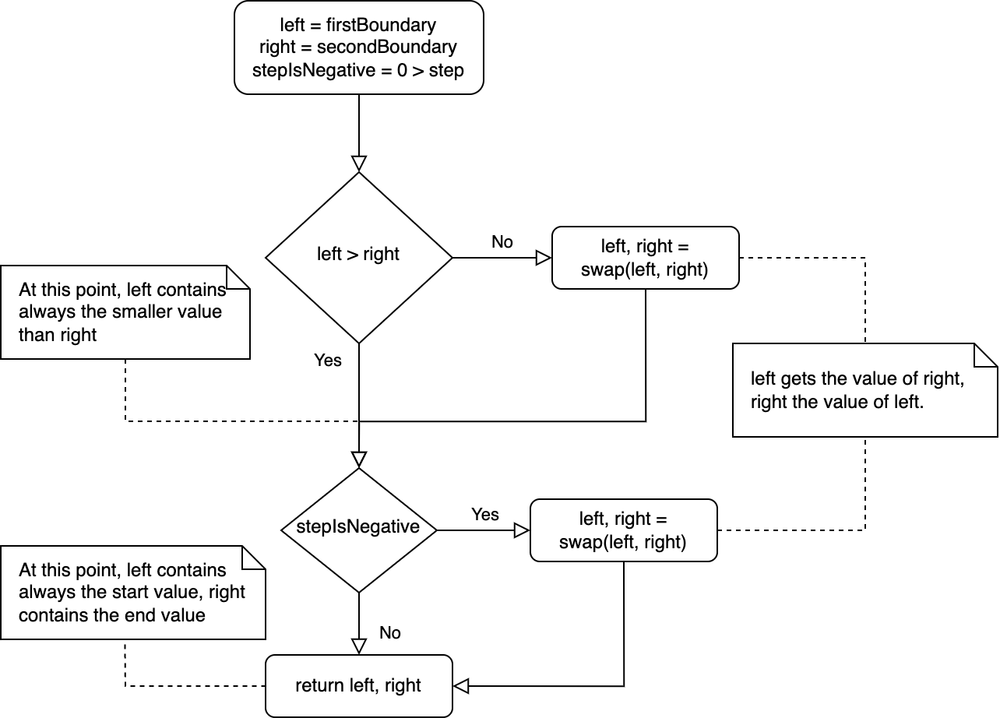

# Range


This section explains what a range is, how it works and how a new range can be created using the Kolibri.


## Introduction

### What is a range?

A range function or range constructor returns a mostly finite sequence of numbers. Such ranges are built into many programming languages such as Haskell, Python or Kotlin. Often a range function can be parameterized with a start value and an end value. If a range is being iterated, the individual elements are processed one after the other.

In Haskell, for example, a range of numbers can be generated like this:


```haskell
ghci> r = [1..20] -- contains the numbers from 1 up to 20.
ghci> r
[1,2,3,4,5,6,7,8,9,10,11,12,13,14,15,16,17,18,19,20]
ghci> r = [1..] -- contains an infinite range
ghci> drop 5 (take 10 c) -- takes the first 10 numbers generated by this infinite range, then ignores the first 5
[6,7,8,9,10]
```


### What can a range be used for?

Ranges can process sequences of almost any size and require hardly any memory or computing power. They are therefore very well suited as building blocks for larger constructs. Because ranges process sequences of numbers they can be used versatile. Possible use cases are for example the lazy generation of numbers or to execute a certain action `n` times.

The example above from Haskell shows nicely how a range can be processed further. For example, elements can be skipped or parts can be cut off. With further such operations the use cases of ranges are hardly limited.

### A range for the Kolibri

There are no built-in ranges in JavaScript. Since JavaScript is a functional programming language at its core and also allows many functional paradigms, it is quite desirable to have similar possibilities with ranges that for example the functional programming language Haskell offers.&#x20;

Therefore a range is added to the Kolibri. Under the hood, the range uses a [Kolibri Iterator](iterator.md). Therefore, all [Kolibri Iterator operations](iterator.md#iterator-functions) can also be performed on the range.

## Research

Since many programming languages already have built-in ranges, it was intuitively clear how the range should be used in Kolibri. What should be mentioned, however, is that not all programming languages treat the boundaries of the ranges the same. In Kotlin and Haskell, for example, both boundaries are inclusive. A range of 1 - 3 contains the elements 1, 2, 3. In Python only the lower limit is inclusive. Therefore to create the same range in Python the limits must be set to 1 and 4.&#x20;

Since it seems more intuitive to have both borders inclusive, the range for Kolibri works accordingly.

## Features

* **Parametrization**: The range can be initialized with 1-3 parameters. The parameters specify the lower limit, the upper limit and the step size. If not all parameters are set the range uses suitable default values.
* **Interchangeable boundaries:** Lower and upper limit can be interchanged when creating a new range.
* **Negative boundaries & step**: The boundaries and the step size of the range can be positive or negative integers.&#x20;
* **Iteration protocols**: The range is implemented using a Kolibri Iterator and is therefore compliant with the JS iteration protocols.

## Implementation

Since the range is implemented using a Kolibri Iterator, it is built on the three components `startValue`, `incrementFunction` & `stopDetected`.

### Normalization of the boundaries

Since the boundaries of the range are interchangeable and the step can be a positive or negative integer, the first boundary and the second boundary are normalized at first. Depending on the step value, this normalization is used to find out which boundary contains the first number to be produced and which the last. The new normalized boundaries are then both stored as local const `left` and `right`. The value `left` will be used as starting value in the Kolibri Iterator, `right` for the stop detection.

This normalization process is explained by the following flow chart diagram:

<figure><figcaption><p>The normalization process of <code>firstBoundary</code> and <code>secondBoundary</code>. </p></figcaption></figure>

### Increment function

In a range, it's pretty easy to get from the current step to the next. The chosen step size is added to the current state. &#x20;

### Stop detection

To find out if a range has reached the end of its values, the current value (`next`) is compared with the defined end (`right`).&#x20;

There are two cases to be considered:

1. If the step size is a negative value, it is counted from top to bottom: The range is at the end as soon as the `next` is smaller than `right`.&#x20;
2. If the step size is positive, it is counted from bottom to top: The range is then at the end as soon as `next` is greater than the value `right`. Given these rules, the stop detection is built like:

```javascript
const hasReachedEnd = (stepIsNegative, next, end) =>
    stepIsNegative ? next < end : next > end;
```


If `(right - left) % step` does not result in `0`, the last returned value of the range is smaller than `right`.


### Implementation of the range

Given the above described functionality the range is implemented as:

```javascript
const Range = (firstBoundary, secondBoundary = 1, step = 1) => {
  const stepIsNegative = 0 > step;
  // boundaries are normaleized according to the flow chart above
  const [left, right]  = normalize(firstBoundary, secondBoundary, stepIsNegative);

  // a new Kolibri Iterator is created
  return Iterator(
    left,
    value => value + step,
    value => hasReachedEnd(stepIsNegative, value, right)
  );
};
```

## Usage

To see the range in action the [Examples](range.md#examples) section should be considered.


Since the range returns a specialized [Kolibri Iterator](iterator.md), all the [Kolibri Iterator functions](iterator.md#iterator-functions) can be used with the range as well! So for example it is possible, to `map` over a range and then `reduce` it to a single value.


### Instantiation&#x20;

A range can be instantiated using the constructor function `Range()` exported by `range.js`.

The `Range` constructor takes 1 to 3 parameters:

| Name             | Description                                                                       | Defaultvalue | Mandatory |
| ---------------- | --------------------------------------------------------------------------------- | -----------: | --------- |
| `firstBoundary`  | Defines the first boundary of the range, but not necessarily the lower boundary.  |            - | _yes_     |
| `secondBoundary` | Defines the second boundary of the range, but not necessarily the upper boundary. |            0 | _no_      |
| `step`           | Defines the step size of the range.                                               |            1 | _no_      |


Since each combination between the `firstBoundary`, the `secondBoundary` and the `step` is unique, the boundaries can be interchanged.


### Contract

When using the Kolibri `Range` constructor, the following things must be respected:

* End-value may not be reached exactly, but will never be exceeded.
* Zero step size leads to infinite loops, returning always the same values
* Only values that behave correctly with respect to addition and size comparison may be passed as arguments.

### Examples

Assumption that the implementation of the range is located under `/range/`.

```javascript
import { Range } from "./range/range.js"

// typical cases
// logs the values 0,1,2,3
for (const value of Range(3)) { console.log(value); }

// logs the values 2,3
for (const value of Range(2,3)) { console.log(value); }

// lower and upper boundaries interchanged
// logs the values 2,3
for (const value of Range(3,2,1)) { console.log(value); }

// negative step size
// logs the values 6,4
for (const value of Range(4,6,-2)) { console.log(value); }

// logs the values 6, 4
for (const value of Range(6,4,-2)) { console.log(value); }

// logs 0 since Range complies to the iterator protocol
for (const value of Range(7)) {
    console.log(value);
    break;
}

// one can only iterate once over a constant iterator
const threetimes = Range(3);
// logs 0,1,2,3
for (const value of threetimes) { console.log(value); }
// does not iterate
for (const value of threetimes) { console.log(value); }

// range with negatgive boundary
// logs 0, -1, -2
for (const value of Range(0,-2,-1)) { console.log(value); }

// logs 10_000, 10_001, 10_002, 10_003
for (const value of Range(Number.MAX_VALUE)) {
    if (value < 10_000) continue;      // first 10_000 values are skipped   
    if (value < 10_003 === false) break;  // exits loop as soon value >= 10_003
    console.log(value);
}

// usage of iterator functions
// sum over the first the numbers 0-100
const sum = Range(100).reduce$((acc, curr) => acc + curr, 0); 

// combine iterator functions on range
const values = Range(1, 10) // new range from 1-10
    .take(5) // only process values 1,2,3,4,5
    .retainAll(curr => curr % 2 === 0) // only keep even values
    .map(curr => 2 * curr);
console.log(...values); // logs 4,8
```

## References

| Ranges in Kotlin | [https://kotlinlang.org/docs/ranges.html](https://kotlinlang.org/docs/ranges.html)                                                             |
| ---------------- | ---------------------------------------------------------------------------------------------------------------------------------------------- |
| Ranges in Python | [https://www.w3schools.com/python/ref\_func\_range.asp](https://www.w3schools.com/python/ref\_func\_range.asp)                                 |
| Lists in Haskell | [https://hackage.haskell.org/package/base-4.17.0.0/docs/Data-List.html](https://hackage.haskell.org/package/base-4.17.0.0/docs/Data-List.html) |
